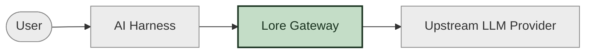
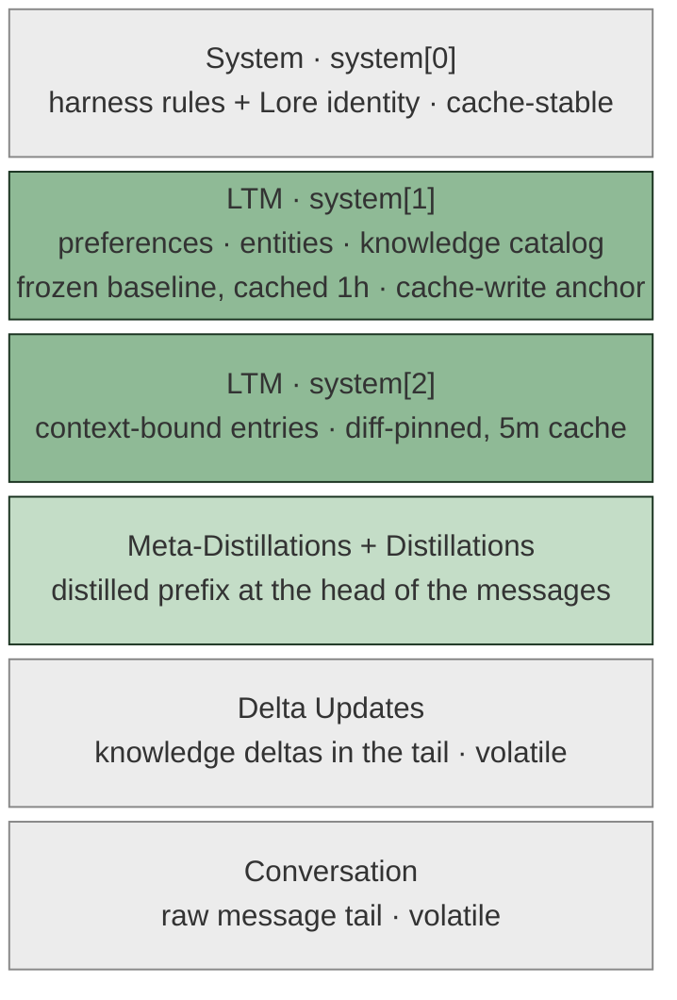
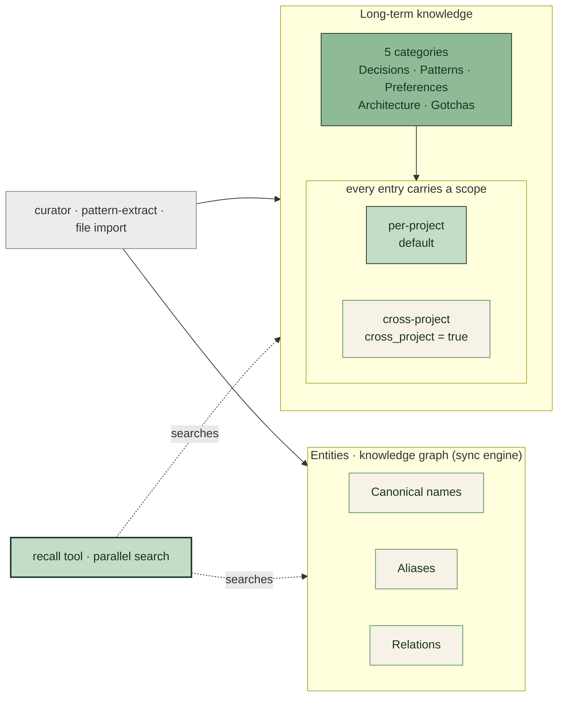
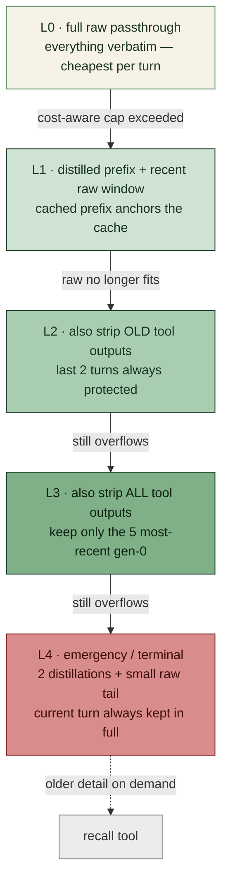
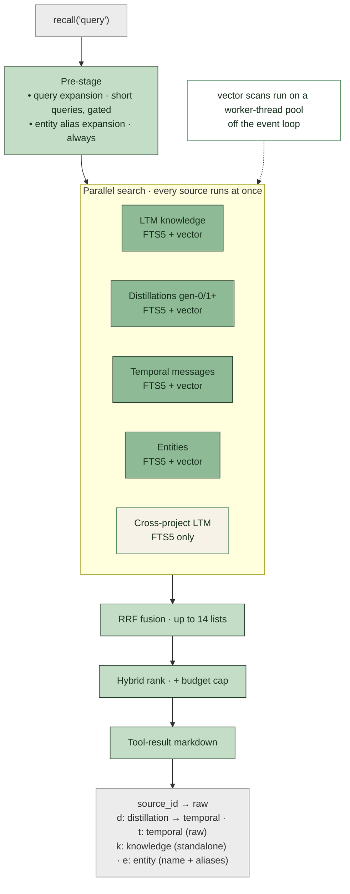

Lore treats context management and memory as one pipeline. The same gradient engine that decides what to put in the prompt also decides when to distill, when to compress, and when to bust the cache — balancing detail preservation against cost on every turn.

## Where Lore fits in the stack

Lore is a **transparent HTTP proxy** that sits between an AI harness and its upstream LLM provider. Every supported harness — Claude Code, Codex, OpenCode, Pi, or Hermes — already speaks one of the standard LLM HTTP APIs (Anthropic's `/v1/messages`, OpenAI's `/v1/chat/completions` and `/v1/responses`, Codex's `/v1/codex/responses`). Lore redirects those requests to its own gateway, where the conversation is parsed, persisted, and transformed before being forwarded to the real upstream. The agent never knows it's there.

This position is deliberate. It means Lore is **agent-agnostic by construction** — any new harness that uses one of those HTTP APIs gets the full memory pipeline for free, with no per-harness SDK. It also means every conversation is captured exactly once, at the only place where it exists as structured LLM traffic: the request itself.

Existing AI harnesses are also **closed ecosystems**: Claude Code, Codex, and the others don't expose their internals to plugins in a way that lets an external tool actively manage context mid-conversation. Sitting at the HTTP boundary — the one place these harnesses must cross to talk to a model — is the only viable integration point that works with every harness, current and future. It's also the only way to stay portable: switching harnesses doesn't lose your memory, because Lore lives below them, not inside.



The supported agents reach the proxy through one of three mechanisms:

- **`lore run` auto-detects all five agents** (`gateway/src/cli/agents.ts`) and sets the right base-URL knob for each: `ANTHROPIC_BASE_URL` for Claude Code and Pi, `OPENAI_BASE_URL` for Hermes, and the `codex -c openai_base_url=...` CLI flag for Codex (the Codex CLI is a Rust binary that doesn't read `OPENAI_BASE_URL`).
- **OpenCode and Pi additionally ship dedicated plugins** (`@loreai/opencode`, `@loreai/pi`) that install a fetch interceptor and pin each provider's `baseURL` to the local gateway — so they work even when launched outside `lore run`.
- **Anything else** that reads `baseURL` from the environment can be pointed at the gateway manually.

## How context and knowledge flow through Lore

Once a request lands in the gateway, two flows kick off in parallel: a **request path** that runs on every LLM call and shapes the prompt, and a **knowledge path** that runs on an idle tick and consolidates the conversation into long-term memory. The diagram below ties both flows to a single formula — the six things every LLM call sees, regardless of what triggered it:

**System + LTM + Meta-Distillations + Distillations + Delta Updates + Conversation**

They stack into one contiguous prompt, read top to bottom — the cache-stable blocks on top (green is the LTM cache-write anchor), the volatile message tail at the bottom:



The formula's parts map onto the wire in the order the model reads them. **System** is `system[0]` — the harness rules and Lore's identity, cache-stable. **LTM** spans two system blocks: `system[1]` holds the stable baseline (preferences, known entities, and a knowledge catalog), frozen for the session and cached at a 1-hour TTL — it's the cache-write anchor — while `system[2]` holds the context-bound entries, re-pinned only when they materially change (see the [LTM pin invariant](#the-ltm-pin-frozen-baseline) below). **Meta-Distillations** and **Distillations** are not a system block at all: they ride at the head of the message array as a distilled prefix, kept byte-stable so appending a new turn stays cheap. **Delta Updates** and **Conversation** fill the rest of the message tail (volatile, ID-referenced, not cache-stable). The gradient's job is to compose these pieces within the context-window budget on every turn; the next section zooms in on that composition.

## Three-tier memory

### Tier 1 — Temporal storage

Every message is stored locally in SQLite with full-text search. This creates a searchable raw history that the recall tool can query when distilled context is not enough. Temporal storage is the ground truth — distillations and long-term knowledge are *derived* from it, never the other way around.

### Tier 2 — Distillation

Conversation segments are distilled into observation logs by an LLM observer. Distillations preserve the operational details that summaries lose: file paths, error messages, exact decisions, command output. They are timestamped, append-only, and consolidated by a second-pass meta-distillation when the gen-0 count crosses a threshold (default 20). Older distillations are still searchable via recall; only the in-context prefix is consolidated.

### Tier 3 — Long-term knowledge

Durable project facts — decisions, patterns, preferences, gotchas — are curated into long-term memory. The curator is an LLM call that runs on idle or after a configurable number of turns. Curated knowledge can be exported to `.lore.md` and reviewed in pull requests, so team knowledge moves with the code, not in a private database.

#### Long-term knowledge structure

The LTM table stores five categories of curated entries, each carrying a scope — **per-project** (the default, scoped to the working directory) or **cross-project** (`cross_project: true`, available across every project the gateway sees). Per-project knowledge is always in play; cross-project entries join the search only when the scope is `all`, fused in rather than consulted as a strict fallback. **Entities** are a sibling concept: a knowledge graph (canonical names, aliases, relations) maintained by the sync engine, not an LTM category. The recall tool searches them alongside LTM, distillations, and temporal messages.



## Gradient context manager

The gradient context manager is what makes Lore different from a summarization wrapper. It is a five-layer system (L0–L4) that decides — on **every turn** — how much of each tier to include in the next request, balancing detail preservation against prompt-cache cost. Each layer keeps everything the layer above it did and removes a little more.

| Layer | Contents | When used |
|---|---|---|
| **0** | Full raw window (no distillation, no compression) | Best quality. Default for sessions under the cost-aware cap. |
| **1** | Distilled prefix + recent raw window | When the raw window no longer fits. The cached distilled prefix is the cache-write anchor — appending a new raw message at the front is cheap. |
| **2** | Distilled prefix + raw window with old tool outputs stripped | When the distilled prefix plus full raw still overflows. Tool outputs from old turns are replaced with compact annotations preserving line count, error signals, and file paths. The last 2 turns are always protected from stripping. |
| **3** | Distilled prefix + raw window with all tool outputs stripped + only the 5 most-recent gen-0 distillations retained | Heavy compression. The 5 most recent gen-0 segments retain full detail in the prefix; older distillations are consolidated by the meta-distillation pass. |
| **4** | Only the 2 most-recent distillations + a small raw tail (`clamp(usable × 0.25, 2K, 8K)` tokens); the current turn is always included in full | Emergency, terminal layer. Tool outputs are *not* stripped here (that would make the model re-invoke its own in-progress tool calls); instead the oldest messages are dropped, and the recall tool retrieves anything older the model still needs. |

The escalation between layers is automatic. The 0→1 boundary is driven by **cost-aware context management** (see below); the 1→2, 2→3, and 3→4 boundaries are driven by token-fit. There is also a per-session `forceMinLayer` floor, persisted to SQLite, that survives process restarts — when the upstream API returns "prompt is too long", the error handler raises the floor to the layer that fits (2 or 3, depending on how badly the request overshot), and the next turn starts there.

The layers form an **escalation ladder** — only one is active on any given turn, and the gradient walks *down* it only as far as the budget and token-fit force it. The diagram reads top-to-bottom as increasing compression: each rung labels what it removes from the stacked prompt above, and the edges label what pushes the gradient to the next rung.



#### The LTM pin frozen-baseline

`system[2]` — the third system block, holding context-bound LTM — is **diff-pinned**. The set of entry keys rendered into it is captured the moment the pin is first established and held constant for the rest of the session: later turns re-render the *same* keys, so the block stays byte-stable even as entries are added, edited, or curated out of the top-K. Genuinely new or changed entries don't rewrite the block; they're surfaced as append-only **delta updates** in the message tail. That keeps `system[2]` stable against the 5-minute conversation cache, while the separate `system[1]` baseline (preferences, entities, knowledge catalog) is frozen for the whole session and cached at the 1-hour TTL. Advancing the pinned set on every turn would instead rewrite the block — busting the cache every turn and paying the cache-write price on top.

## Cost-aware context management

Lore's pricing is built around prompt-cache economics. A typical session spends most of its time at layer 0 (full passthrough) where the marginal cost of adding a message is the cache-read cost — roughly an order of magnitude cheaper than cache-write. Lore is designed to keep you in layer 0 for as long as it makes economic sense to do so.

### The cost-aware layer-0 cap

Layer 0 (full-raw passthrough) is the cheapest layer to *use* — adding a message costs only the cache-read price for the message's tokens, ~10× cheaper than a cache write. But the layer-0 prompt itself is the *whole conversation*, so every turn pays cache-read for that full window. As sessions grow, the per-turn cache-read cost grows linearly. A 200K-token prompt at Claude Sonnet's cache-read price ($3/Mtok) costs $0.60 per turn to re-read; a 600K-token prompt costs $1.80 per turn. At 100 turns, that's $60-$180 of cache reads on a single session — most of the model's full-context cost.

The layer-0 cap is the answer. Instead of "use the full context because it's there", Lore asks: "for a given per-turn budget, how many tokens of layer-0 context fit?" The cap is derived from your model and your `budget.targetCacheReadCostPerTurn` setting (default `$0.10`):

```
maxLayer0Tokens = max(target / model.cost.cache.read, 40K)
```

So a Claude Sonnet session with `cache.read = $3/Mtok` and the default target works out to ~33K from the formula — which lands *below* the 40K floor, so the floor wins and the cap is **40K**. A cheaper model with `cache.read = $0.30/Mtok` clears the floor easily and gets a 333K cap. **The floor at 40K is a safety net**: a free-write or near-zero-cost provider would otherwise produce an absurdly large or even negative cap. 40K is enough to fit a representative code-editing session comfortably and small enough that the worst-case per-turn read cost stays bounded.

The default of `$0.10` per turn is calibrated to a typical developer session: ~100 turns/day × $0.10 = $10 in cache reads, sitting comfortably under most pro-tier daily budgets. **Lower the target** (say to $0.05) and the cap drops proportionally — sessions compress earlier, layer 1/2/3 kick in sooner, and total spend decreases. **Raise it** (to $0.30 or $0.50) and the cap grows — sessions stay in layer 0 longer, but you pay more in cache reads. Set the cap to $0 to disable cost-aware capping entirely (the session then uses the model's full context at layer 0). Set `budget.maxLayer0Tokens` directly to override the formula and pin a specific cap (useful for benchmarks, or for forcing layer 1 to engage earlier than the cost model would naturally dictate).

Two side branches tighten the cap further in specific situations:

- **Cold-cache first turn.** On the very first turn, the entire context is a cache WRITE at 12.5× the cache-read price. Lore applies a 70% multiplier to the cap on uncalibrated turns (no prior API data to confirm the cap) — paying a smaller cold-write is cheaper than writing the full context for a 1-turn session that may end right after.
- **Free-write or non-caching providers.** When the upstream reports zero cache-creation tokens for 3+ consecutive turns (free-write cache, MiniMax passive caching, or no caching at all), Lore caps layer 0 at 65% of the model's max input — there's no expensive cache write to avoid, so it compresses earlier to leave headroom for tool-heavy turns that follow.

### Tier-based bust-vs-continue

At larger context sizes, the choice between "bust the cache" (compress and re-write, paying cache-write) and "keep growing" (pay cache-read for the new message) becomes a real economic decision. Lore makes this per-turn based on three model-quality tiers:

| Tier | Token range | Behavior |
|---|---|---|
| **1** | 0 – 200K | Best quality. No compression pressure. |
| **2** | 200K – 500K | Acceptable quality. Lore compares bust cost vs continue cost and only compresses when it makes economic sense. |
| **3** | 500K – model limit | Degraded quality. Compression is more aggressive but still gated by the same economic check. |

The per-turn math:

```
bustCost    = compressedSize × cacheWriteCostPerToken
continueCost = currentSize   × cacheReadCostPerToken
compress when bustCost < continueCost × threshold
```

If 2+ consecutive turns bust the cache, Lore stops trying to compress and just keeps growing — something structural is causing the busts, and forced compression would just add cost on top of churn. The threshold is per-tier, calibrated so that compression fires in the same scenarios where the user would manually choose it.

### Per-turn usage signal

Lore records the actual cache-hit / cache-creation / cache-read token counts from each upstream response into a rolling window. This calibration closes the loop on the cost estimates: if the model is returning higher cache-read costs than the static table predicts, the layer-0 cap drops to compensate. Sessions self-tune to the actual model-pricing regime, not the published one.

### Cost tracker

The cost tracker watches the session against an optional `LORE_DAILY_BUDGET` (USD) cap. When the session is projected to exceed the cap, Lore does two things:

1. **Compresses earlier** — forces layer 2 at smaller context sizes, trading prompt detail for per-turn spend.
2. **Injects invisible proxy-level sleeps** to slow the agent's request rate. The throttle delay is computed from the current spend velocity vs the budget, with the curve `MAX_THROTTLE_DELAY × pressure² × tanh(overshoot / 3)`. A session burning twice its target rate gets a squared penalty; one burning at 3× the target saturates to the max delay. The delay is also capped to keep the next request *inside* the cache TTL window (delaying past TTL would bust the cache and undo the savings).

A second independent throttle signal comes from the **Anthropic OAuth quota** (`packages/gateway/src/quota.ts`): the gateway tracks the model's utilization against its rolling OAuth entitlement — the higher of the 5-hour and 7-day windows — and derives a quota pressure in `[0, 1]`. The final delay is the **max** of the budget-derived delay and the quota-derived delay, so either signal can engage throttling — and quota throttling works even when no USD budget is configured (a free user on a tight OAuth entitlement still gets throttled, not silently 429'd).

The dashboard surfaces a "budget pressure" signal with two counters: `throttle.events` (number of requests delayed) and `throttle.totalDelayMs` (total wait time imposed).

## Distillation pipeline

The distillation pipeline runs on idle, on a debounced timer. The first distillation is conservative (5 messages, 64 tokens minimum). As segments accumulate, gen-0 segments are emitted, and when the count crosses `metaThreshold` (default 20) a second-pass meta-distillation consolidates them. Meta-distillation keeps the 5 most recent gen-0 segments in the in-context prefix un-archived; older ones become a single higher-level summary that the recall tool can still search.

The distillation input is rendered from temporal messages with a configurable `toolOutputMaxChars` truncation (default 4000) — tool outputs longer than this are replaced with a compact annotation preserving line count, error signals, and file paths. This is what keeps distillation input from blowing up on noisy tool runs.

## Recall tool

The recall tool is the escape hatch when neither the in-context prefix nor the gradient layer has the answer. It runs a hybrid search over temporal messages, distillations, and the knowledge base, fusing:

- **BM25 keyword search** over FTS5 indices, with per-column weights configurable in `search.ftsWeights` (default: title 6, content 2, category 3).
- **Vector similarity search** using `@huggingface/transformers` + `nomic-embed-text-v1.5` (768-dim INT8 quantized, on-device by default). The embedding model runs in a dedicated worker thread, so inference never blocks the gateway's event loop. Hosted providers (`voyage`, `openai`) are an explicit opt-in via `search.embeddings.provider` in `.lore.json` — there is no automatic fallback from local to remote. If the local model fails to load (for example, on Linux/x64 with CUDA 13 where `onnxruntime-node` is broken), recall degrades to FTS-only with a one-time `log.info` notification.
- **LLM-based query expansion** generates 2-3 alternative phrasings of the query before search, guarded by a 3-second timeout.

Results are fused with reciprocal rank fusion (RRF) and re-ranked. A query-expansion-aware boost is applied to vector results when the query has enough terms (≥2 after stopword removal) — single-term queries stay on BM25 because that's where it wins.

The diagram below shows the recall pipeline. **Vector search is per-source, not a separate stage** — four of the five sources shown (LTM, distillations, temporal messages, entities) run both an FTS5 query and a vector query, and both lists feed the same RRF. The fifth — cross-project LTM — plus the `lat.md` sections are FTS-only, because the vector index only covers the current project's rows. The vector scans run on a small **worker-thread pool** (default 2 workers, each with its own read-only database connection), so a large similarity scan never blocks the gateway's event loop; a scan that exceeds its timeout returns empty rather than falling back to a blocking main-thread scan.



When the scope is `all` and the session already has its own results, recall downweights the knowledge BM25 list (factor 0.6) so current-session context — distillations and temporal messages — ranks above general curated knowledge.

## What this means in practice

You should not have to think about context management. The gradient engine handles layer escalation, the cost-aware cap keeps you in the cheap layer for as long as possible, distillation preserves the details that summaries lose, and the recall tool gives you a way out when none of the layers have what you need. The settings that *are* worth tuning (cost targets, distillation thresholds, embedding provider) are surfaced in the [configuration reference](../configuration/).
